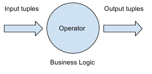
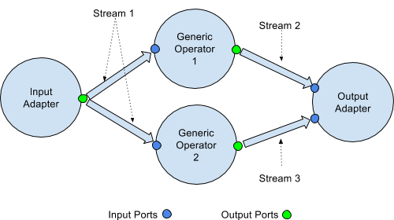
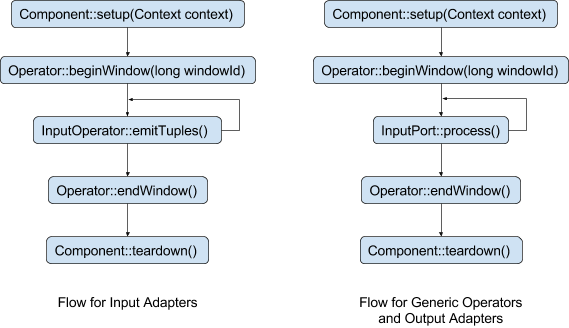
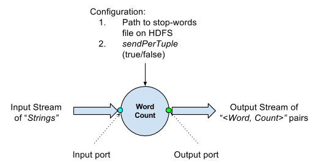

Operator Development Guide
==========================

Operators are basic building blocks of an application built to run on
Apache Apex platform. An application may consist of one or more
operators each of which define some logical operation to be done on the
tuples arriving at the operator. These operators are connected together
using streams forming a Directed Acyclic Graph (DAG). In other words, a streaming
application is represented by a DAG that consists of operations (called operators) and
data flow (called streams).

In this document we will discuss details on how an operator works and
its internals. This document is intended to serve the following purposes

1.  **[Apache Apex Operators](#apex_operators)** - Introduction to operator terminology and concepts.
2.  **[Writing Custom Operators](#writing_custom_operators)** - Designing, coding and testing new operators from scratch.  Includes code examples.
3.  **[Operator Reference](#operator_reference)** - Details of operator internals, lifecycle, and best practices and optimizations.

* * * * *

Apache Apex Operators <a name="apex_operators"></a>
==========================================

Operators - “What” in a nutshell
--------------------------------

Operators are independent units of logical operations which can
contribute in executing the business logic of a use case. For example,
in an ETL workflow, a filtering operation can be represented by a single
operator. This filtering operator will be responsible for doing just one
task in the ETL pipeline, i.e. filter incoming tuples. Operators do not
impose any restrictions on what can or cannot be done as part of a
operator. An operator may as well contain the entire business logic.
However, it is recommended, that the operators are light weight
independent tasks, in
order to take advantage of the distributed framework that Apache Apex
provides. The structure of a streaming application shares resemblance
with the way CPU pipelining works. CPU pipelining breaks down the
computation engine into different stages viz. instruction fetch,
instruction decode, etc. so that each of them can perform their task on
different instructions
parallely. Similarly,
Apache Apex APIs allow the user to break down their tasks into different
stages so that all of the tasks can be executed on different tuples
parallely.



Operators - “How” in a nutshell
-------------------------------

An Apache Apex application runs as a YARN application. Hence, each of
the operators that the application DAG contains, runs in one of the
containers provisioned by YARN. Further, Apache Apex exposes APIs to
allow the user to request bundling multiple operators in a single node,
a single container or even a single thread. We shall look at these calls
in the reference sections [cite reference sections]. For now, consider
an operator as some piece of code that runs on some machine of a YARN
cluster.

Types of Operators
------------------

An operator works on one tuple at a time. These tuples may be supplied
by some other operator in the application or by some external source,
like a database or a message bus. Similarly, after the tuples are
processed, these may be passed on to some other operator, or may be
stored into some external system. Based on the functions that the
Operator performs, we have the following types of operators:

1.  **Input Adapter** - This is one of the starting points in
    the application DAG and is responsible for getting tuples from an
    external system. At the same time, such data may also be generated
    by the operator itself, without interacting with the outside
    world. These input tuples will form the initial universe of
    data that the application works on.
2.  **Generic Operator** - This type of operator accepts input tuples from
    the previous operators and passes them on to the following operators
    in the DAG.
3.  **Output Adapter** - This is one of the ending points in the application
    DAG and is responsible for writing the data out to some external
    system.

Note: There can be multiple operators of all types in an application
DAG.

Positioning of Operators in the DAG
-----------------------------------

We may refer to operators depending on their position with respect to
one another. For any operator opr (see image below), there are two types of operators.

1.  **Upstream operators** - These are the operators from which there is a
    directed path to opr in the application DAG.
2.  **Downstream operators** - These are the operators to which there is a
    directed path from opr in the application DAG.

Note that there are no cycles formed in the application DAG.


Ports
-----

Operators in a DAG are connected together via directed flows
called streams. Each stream has end-points located on the operators
called ports. Therea are two types of ports.

1.  **Input Port** - This is a port through which an operator accepts input
    tuples from an upstream operator.
2.  **Output port** - This is a port through which an operator passes on the
    processed data to downstream operators.

Looking at the number of input ports, an Input Adapter is an operator
with no input ports, a Generic operator has both input and output ports,
while an Output Adapter has no output ports. At the same time, note that
an operator may act as an Input Adapter while at the same time have an
input port. In such cases, the operator is getting data from two
different sources, viz. the input stream from the input port and an
external source.



* * * * *

How Operator Works
----------------------

An operator passes through various stages during its lifetime. Each
stage is an API call that the streaming application master makes for an
operator.  The following figure illustrates the stages through which an
operator passes.



-   The _setup()_ call initializes the operator and prepares itself to
    start processing tuples.
-   The _beginWindow()_ call marks the beginning of an application window
    and allows for any processing to be done before a window starts.
-   The _process()_ call belongs to the _InputPort_ and gets triggered when
    any tuple arrives at the Input port of the operator. This call is
    specific only to Generic and Output adapters, since Input Adapters
    do not have an input port. This is made for all the tuples at the
    input port until the end window marker tuple is received on the
    input port.
-   The _emitTuples()_ is the counterpart of _process()_ call for Input
    Adapters.
    This call is used by Input adapters to emit any tuples that are
    fetched from the external systems, or generated by the operator.
    This method is called continuously until the pre-configured window
    time is elapsed, at which the end window marker tuple is sent out on
    the output port.
-   The _endWindow()_ call marks the end of the window and allows for any
    processing to be done after the window ends.
-   The _teardown()_ call is used for gracefully shutting down the
    operator and releasing any resources held by the operator.

Developing Custom Operators <a name="writing_custom_operators"></a>
====================================

About this tutorial
-------------------

This tutorial will guide the user towards developing a operator from
scratch. It will include all aspects of writing an operator including
design, code as well as unit tests.

Introduction
------------

In this tutorial, we will design and write, from scratch, an operator
called Word Count. This operator will accept tuples of type String,
count the number of occurrences for each word appearing in the tuple and
send out the updated counts for all the words encountered in the tuple.
Further, the operator will also accept a file path on HDFS which will
contain the stop-words which need to be ignored when counting
occurrences.

Design
------

Design of the operator must be finalized before starting to write an
operator. Many aspects including the functionality, the data sources,
the types involved etc. need to be first finalized before writing the
operator. Let us dive into each of these while considering the Word
Count operator.

### Functionality

We can define the scope of operator functionality using the following
tasks:

1.  Parse the input tuple to identify the words in the tuple
2.  Identify the stop-words in the tuple by looking up the stop-word
    file as configured
3.  For each non-stop-word in the tuple, count the occurrences in that
    tuple and add it to a global counts

Let’s consider an example. Suppose we have the following tuples flow
into the Word Count operator.

1.  _Humpty dumpty sat on a wall_
2.  _Humpty dumpty had a great fall_

Initially counts for all words is 0. Once the first tuple is processed,
the counts that must be emitted are:

``` java
humpty - 1
dumpty - 1
sat - 1
wall - 1
```

Note that we are ignoring the stop-words, “on” and “a” in this case.
Also note that as a rule, we’ll ignore the case of the words when
counting occurrences.

Similarly, after the second tuple is processed, the counts that must be
emitted are:

``` java
humpty - 2
dumpty - 2
great - 1
fall - 1
```

Again, we ignore the words _“had”_ and _“a”_ since these are stop-words.

Note that the most recent count for any word is correct count for that
word. In other words, any new output for a word, invalidated all the
previous counts for that word.

### Inputs

As seen from the example above, the following inputs are expected for
the operator:

1.  Input stream whose tuple type is String
2.  Input HDFS file path, pointing to a file containing stop-words

Only one input port is needed. The stop-word file will be small enough
to be read completely in a single read. In addition this will be a one
time activity for the lifetime of the operator. This does not need a
separate input port.


### Outputs

We can define the output for this operator in multiple ways.

1.  The operator may send out the set of counts for which the counts
    have changed after processing each tuple.
2.  Some applications might not need an update after every tuple, but
    only after a certain time duration.

Let us try and implement both these options depending on the
configuration. Let us define a boolean configuration parameter
_“sendPerTuple”_. The value of this parameter will indicate whether the
updated counts for words need to be emitted after processing each
tuple (true) or after a certain time duration (false).

The type of information the operator will be sending out on the output
port is the same for all the cases. This will be a _< key, value >_ pair,
where the key is the word while, the value is the latest count for that
word. This means we just need one output port on which this information
will go out.



Configuration
-------------

We have the following configuration parameters:

1.  _stopWordFilePath_ - This parameter will store the path to the stop
    word file on HDFS as configured by the user.
2.  _sendPerTuple_ - This parameter decides whether we send out the
    updated counts after processing each tuple or at the end of a
    window. When set to true, the operator will send out the updated
    counts after each tuple, else it will send at the end of
    each window.

Code
----

The source code for the tutorial can be found here:

[https://github.com/DataTorrent/examples/tree/master/tutorials/operatorTutorial](https://www.google.com/url?q=https://github.com/DataTorrent/examples/tree/master/tutorials/operatorTutorial&sa=D&usg=AFQjCNHAAgSpNprHJVvy9GSjdlD1uwU7jw)


Operator Reference <a name="operator_reference"></a>
====================================


### The Operator Class

The operator will exist physically as a class which implements the
Operator interface. This interface will require implementations for the
following method calls:

-  setup(OperatorContext context)
-  beginWindow(long windowId)
-  endWindow()
-  tearDown()

In order to simplify the creation of an operator, the Apache Apex
library also provides a base class “BaseOperator” which has empty
implementations for these methods. Please refer to the [Apex Operators](#apex_operators) section and the
[Reference](#operator_reference) section for details on these.

We extend the class “BaseOperator” to create our own operator
“WordCountOperator”.

``` java
public class WordCountOperator extends BaseOperator
{
}
```

### Class (Operator) properties

We define the following class variables:

-   _sendPerTuple_ - Configures the output frequency from the operator
``` java
private boolean sendPerTuple = true; // default
```
-   _stopWordFilePath_ - Stores the path to the stop words file on HDFS
``` java
private String stopWordFilePath; // no default
```
-   _stopWords_ - Stores the stop words read from the configured file
``` java
private transient String[] stopWords;
```
-   _globalCounts_ - A Map which stores the counts of all the words
    encountered so far. Note that this variable is non transient, which
    means that this variable is saved as part of the check point and can be recovered in event of a crash.
``` java
private Map<String, Long> globalCounts;
```
-   _updatedCounts_ - A Map which stores the counts for only the most
    recent tuple(s). sendPerTuple configuration determines whether to store the most recent or the recent
    window worth of tuples.
``` java
private transient Map<String, Long> updatedCounts;
```
-   _input_ - The input port for the operator. The type of this input port
    is String which means it will only accept tuples of type String. The
    definition of an input port requires implementation of a method
    called process(String tuple), which should have the processing logic
    for the input tuple which  arrives at this input port. We delegate
    this task to another method called processTuple(String tuple). This
    helps in keeping the operator classes extensible by overriding the
    processing logic for the input tuples.
``` java
public transient DefaultInputPort<String> input = new    
DefaultInputPort<String>()
{
    @Override
    public void process(String tuple)
    {
        processTuple(tuple);
    }
};
```
-   output - The output port for the operator. The type of this port is
    Entry < String, Long >, which means the operator will emit < word,
    count > pairs for the updated counts.
``` java
public transient DefaultOutputPort <Entry<String, Long>> output = new
DefaultOutputPort<Entry<String,Long>>();
```

### The Constructor

The constructor is the place where we initialize the non-transient data
structures, since
constructor is called just once per activation of an operator. In case
of Word Count operator, we initialize the globalCounts variable in the
constructor.
``` java
globalCounts = Maps.newHashMap();
```
### Setup call

The setup method is called only once during an operator lifetime and its purpose is to allow 
the operator to set itself up for processing incoming streams. Transient objects in the operator are
not serialized and checkpointed. Hence, it is essential that such objects initialized in the setup call. 
In case of operator failure, the operator will be redeployed (most likely on a different container). The setup method called by the Apache Apex engine allows the operator to prepare for execution in the new container.

The following tasks are executed as part of the setup call:

1.  Read the stop-word list from HDFS and store it in the
    stopWords array
2.  Initialize updatedCounts variable. This will store the updated
    counts for words in most recent tuples processed by the operator.
    As a transient variable, the value will be lost when operator fails.

### Begin Window call

The begin window call signals the start of an application window. In
case of Word Count Operator, if the sendPerTuple is set to false, it
means that we are expecting updated counts for the most recent window of
data. Hence, we clear the updatedCounts variable in the begin window
call and start accumulating the counts till the end window call.

### Process Tuple call

The processTuple method is called by the process method of the input
port, input. This method defines the processing logic for the current
tuple that is received at the input port. As part of this method, we
identify the words in the current tuple and update the globalCounts and
the updatedCounts variables. In addition, if the sendPerTuple variable
is set to true, we also emit the words and corresponding counts in
updatedCounts to the output port. Note that in this case (sendPerTuple =
true), we clear the updatedCounts variable in every call to
processTuple.

### End Window call

This call signals the end of an application window. In case of Word
Count Operator, we emit the updatedCounts to the output port if the
sendPerTuple flag is set to false.

### Teardown call

This method allows the operator to gracefully shut down itself after
releasing the resources that it has acquired. In case of our operator,
we call the shutDown method which shuts down the operator along with any
downstream operators.

Testing your Operator
---------------------

As part of testing our operator, we test the following two facets:

1.  Test output of the operator after processing a single tuple
2.  Test output of the operator after processing of a window of tuples

The unit tests for the WordCount operator are available in the class
WordCountOperatorTest.java. We simulate the behavior of the engine by
using the test utilities provided by Apache Apex libraries. We simulate
the setup, beginWindow, process method of the input port and
endWindow calls and compare the output received at the simulated output
ports.

1. Invoke constructor; non-transients initialized.
2. Copy state from checkpoint -- initialized values from step 1 are
replaced.
